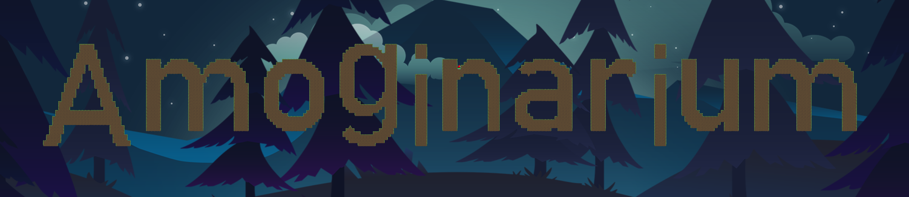
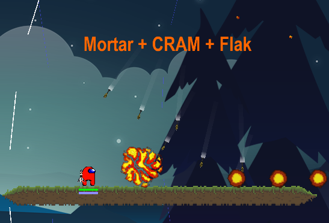
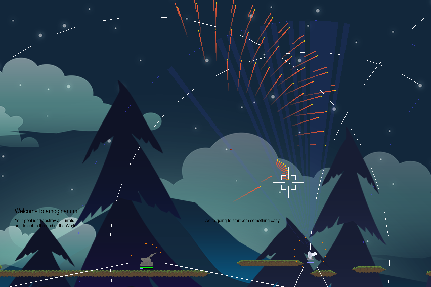
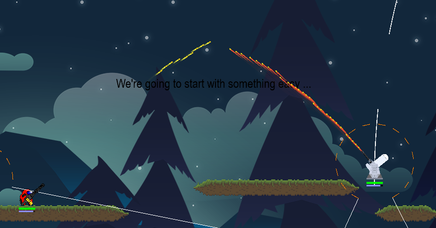
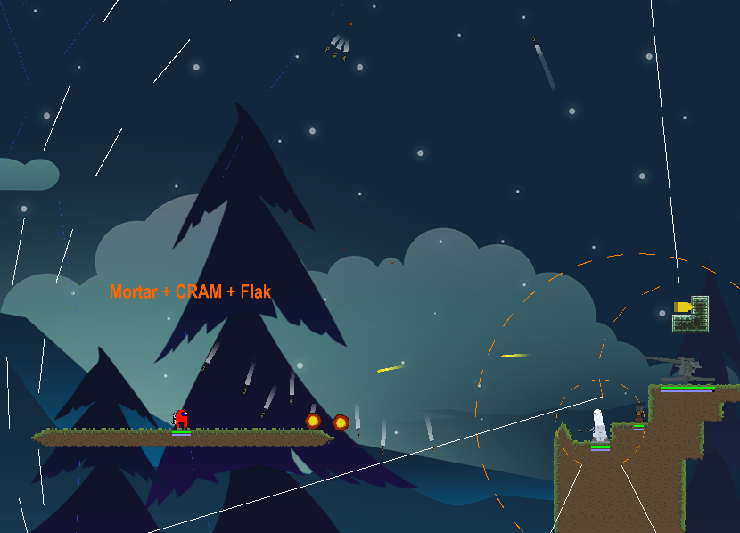

Amoginarium is a high-performance, multi-process 2D game built in Python. Designed to handle complex physics, advanced weaponry systems, and real-time simulations, it solves the performance bottlenecks of traditional Python game development by completely decoupling the game logic from the graphics rendering pipeline using shared memory and heavily optimized Cython. 

## In-Game-Picks

|           <!-- -->           |           <!-- -->           |
|:----------------------------:|:----------------------------:|
|  |  |
|  |  |


## Key Features

* **Multi-Process Architecture:** Strict separation between the continuous logic loop and the graphics rendering pipeline, synchronized via fast shared memory structures.
* **High-Performance Rendering:** Custom OpenGL-based rendering engine.
* **Advanced Weaponry & Physics:** Built-in templates for complex aerodynamic simulations, multi-stage guided missiles, heat seekers, laser designators, and radar sensors.
* **Optimized Execution:** Core collision detection and computational heavy-lifting are accelerated using Cython.
* **Integrated Tooling:** Includes live telemetry dashboards (`debug_analyzer_live.py`) for real-time engine profiling.
* **Extensible UI System:** A robust, event-driven custom UI framework supporting complex easing animations, dynamic text, and interactive widgets.

## Tech Stack & Prerequisites

To run and build Amoginarium, you will need the following environment and dependencies:

* **Language:** Python 3.12
* **Core Libraries:** Pygame-CE (it's very important to uninstall pygame and then install pygame-ce), OpenGL 
* **Performance/Compilation:** Cython
* **Platform:** Windows (sorry Linux)

## Installation

Follow these steps to set up the engine locally.

```bash
# 1. Clone the repository
git clone https://github.com/Nilusink/amoginarium
cd amoginarium

# 2. Create and activate a virtual environment (optional but recommended)
python -m venv venv
venv\Scripts\activate

# 3. Make sure normal pygame is not installed
pip uninstall pygame

# 4. Install required Python dependencies
pip install -r requirements.txt

# 5. Compile the Cython/C++ extensions with OpenMP support
python setup.py build_ext --inplace

# 6. (Optional) Install the automated tooling for architecture generation
cd tools
python setup.py install
cd ..
```

## Usage

**Run the Core Game**
```bash
python main.py
```

**Run the Live Debug Analyzer**
Monitor engine runtimes, memory metrics, and multi-file comparisons in real-time.
```bash
python debug_analyzer_live.py
```
