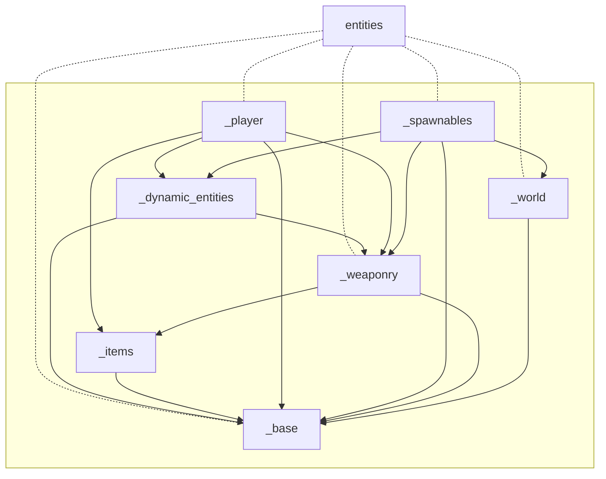
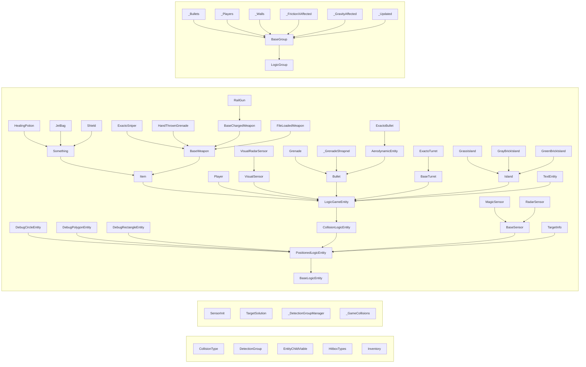

# amoginarium/amoginarium/logic/entities

<h2 style="display:inline-block">Structure</h2>

<h2 style="display:inline-block">Classes</h2>

<!=== MermaidClassesStart ===>

<!=== MermaidClassesEnd ===>

