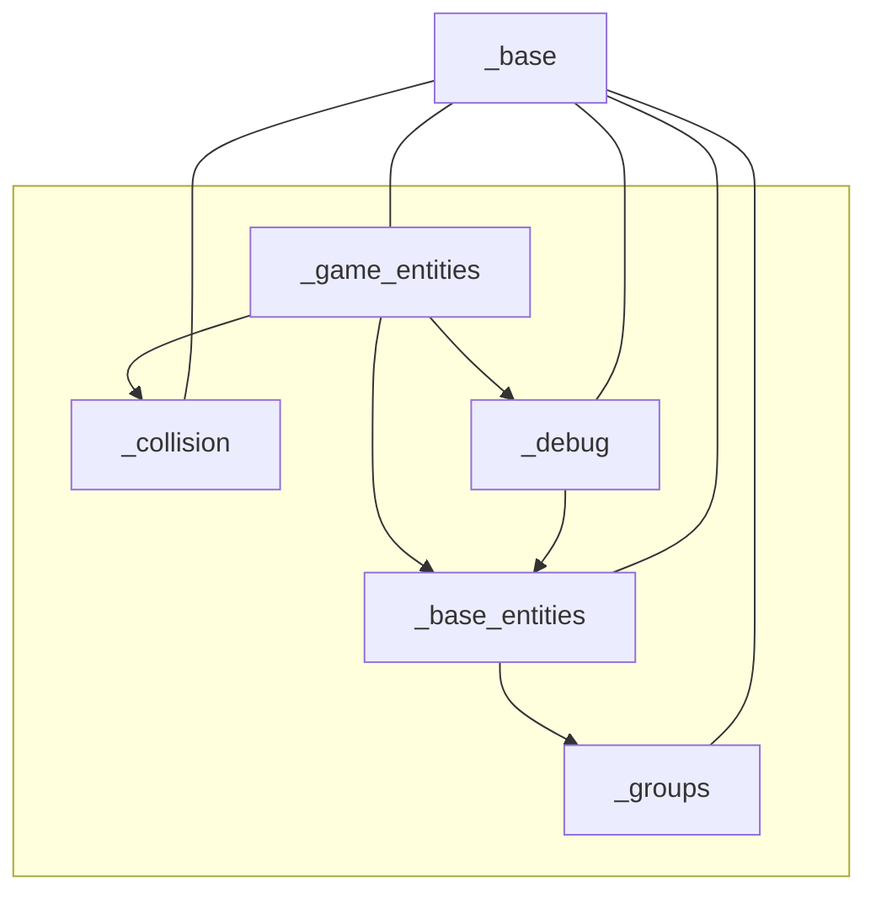
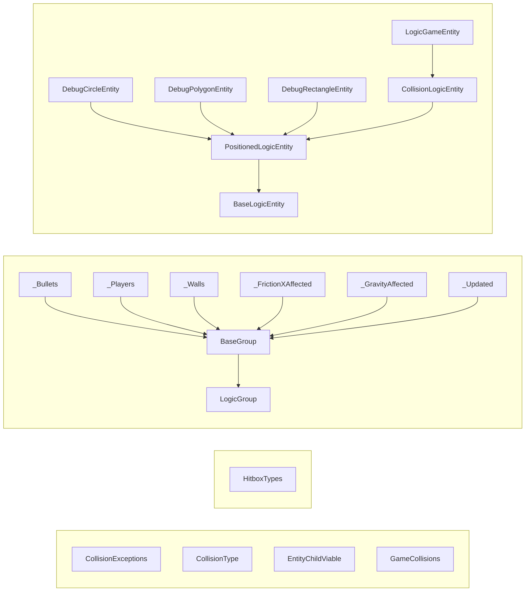

# Structure

```mermaid
graph TD

subgraph Group [" "]
_base_entities
_collision
_debug
_game_entities
_groups
end

_base --- _base_entities
_base --- _collision
_base --- _debug
_base --- _game_entities
_base --- _groups

_base_entities --> _groups
_debug --> _base_entities
_game_entities --> _base_entities
_game_entities --> _collision
_game_entities --> _debug
```

# Classes

```mermaid
graph RL

subgraph Group1 [" "]
CollisionExceptions
CollisionType
EntityChildViable
GameCollisions
end

subgraph Group2 [" "]
HitboxTypes
end

subgraph Group3 [" "]
BaseGroup
LogicGroup
_Bullets
_FrictionXAffected
_GravityAffected
_Players
_Updated
_Walls
end

subgraph Group4 [" "]
BaseLogicEntity
CollisionLogicEntity
DebugCircleEntity
DebugPolygonEntity
DebugRectangleEntity
LogicGameEntity
PositionedLogicEntity
end

PositionedLogicEntity --> BaseLogicEntity
DebugCircleEntity --> PositionedLogicEntity
DebugPolygonEntity --> PositionedLogicEntity
DebugRectangleEntity --> PositionedLogicEntity
CollisionLogicEntity --> PositionedLogicEntity
LogicGameEntity --> CollisionLogicEntity
BaseGroup --> LogicGroup
_Bullets --> BaseGroup
_Players --> BaseGroup
_Walls --> BaseGroup
_FrictionXAffected --> BaseGroup
_GravityAffected --> BaseGroup
_Updated --> BaseGroup
```
