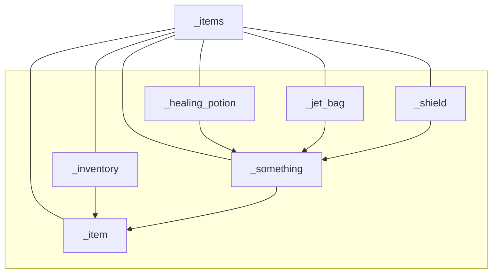
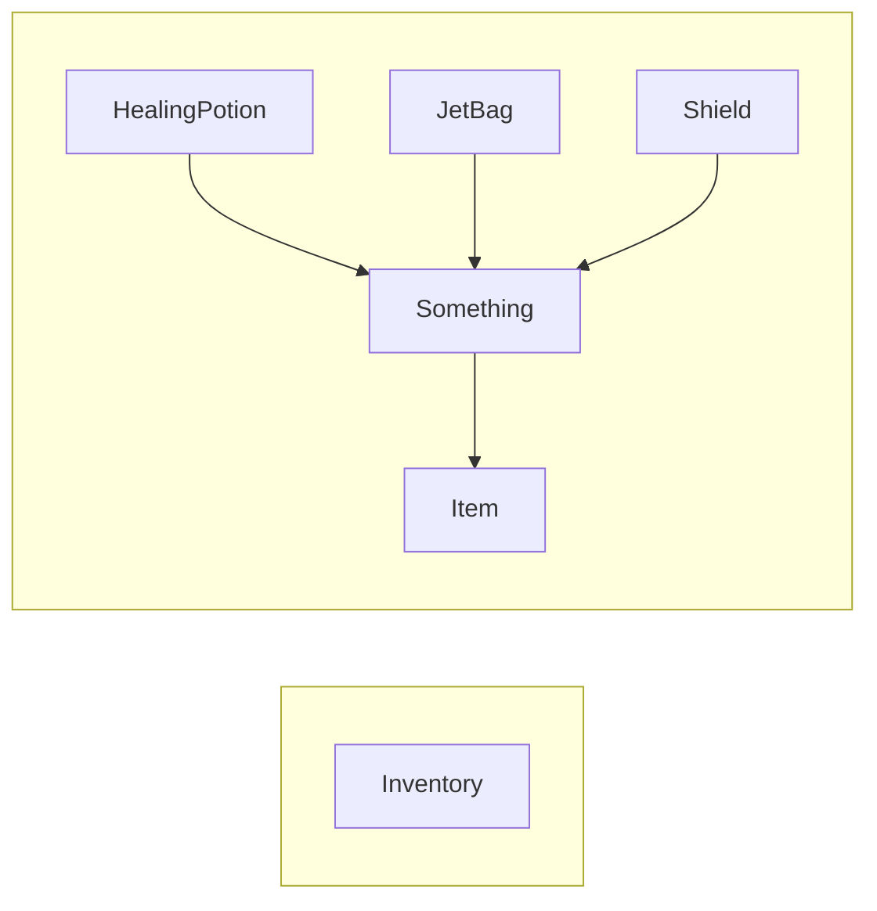

# amoginarium/amoginarium/logic/entities/_items

<h2 style="display:inline-block">Structure</h2>

<!--- MermaidStructureStart --->

<!--- MermaidStructureEnd --->

<h2 style="display:inline-block">Classes</h2>

<!--- MermaidClassesStart --->

<!--- MermaidClassesEnd --->

